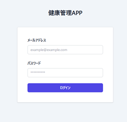
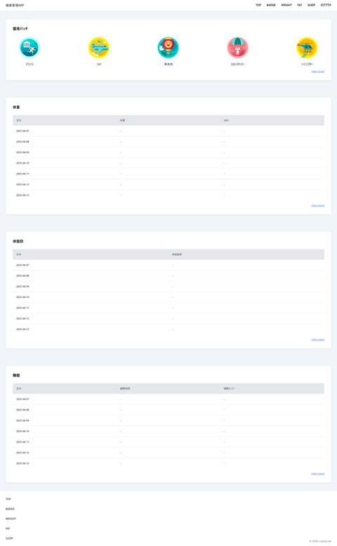

# 健康管理アプリ - フロントエンド


このアプリは、日々の健康情報（**体重・体脂肪率・睡眠時間**）を記録・可視化できるWebサービスです。  
Vue 3（Composition API）と Vite によるSPA構成で、モダンなUIとスムーズなUXを実現しています。

---

## 🌐 デモサイト

- アプリURL:  
  👉 https://health-management.coolat.net

- バックエンドAPI：  
  👉 [health-management-api（Laravel）](https://github.com/RyoheiTanaka/health-management-api)

---

## 📌 主な機能

| 機能                | 説明                                            |
| ------------------- | ----------------------------------------------- |
| 🔐 認証             | Laravel Sanctum によるSPAトークン認証（Cookie） |
| 📝 健康記録         | 体重、体脂肪率、睡眠時間の記録                  |
| 📊 ダッシュボード   | 各データの推移をグラフで可視化                  |
| 🔁 データ通信       | Axios によるAPI連携、日付別取得・送信           |
| 📱 レスポンシブ対応 | Tailwind CSSでモバイルフレンドリーなUI          |

---

## 🛠 使用技術スタック

- **Vue 3**（Composition API）
- **Vite**（高速ビルドツール）
- **Pinia**（状態管理）
- **Vue Router**
- **Axios**
- **Tailwind CSS**
- **デプロイ**：Vercel

---

## 💡 開発のポイント・工夫

- バックエンド（Laravel）とフロントを完全分離（API設計）
- Vite + Tailwind による軽量＆高速なSPA実装
- Axiosをカスタムラッパーで扱い、共通エラーハンドリング対応
- CI/CDはVercelにより自動化（mainブランチpushでデプロイ）

---

## 🖼 スクリーンショット

- ログイン画面  
  

- ダッシュボード  
  

---

## ▶️ 開発環境での起動方法

```
git clone https://github.com/RyoheiTanaka/health-management-frontend.git
cd health-management-frontend
npm install
npm run dev
```

---

## 📄 ライセンス

MIT License
Copyright (c) 2024 Ryohei Tanaka

このソフトウェアは [`MITライセンス`](./LICENSE) のもとで公開されています。
商用・個人利用・改変・再配布すべて自由ですが、著作権表記は保持してください。

---

## 👤 開発者

- **田中 涼平**（[@RyoheiTanaka](https://github.com/RyoheiTanaka)）
- Email: [ryohei.tanaka@coolat.net](mailto:ryohei.tanaka@coolat.net)

ご覧いただきありがとうございました！
